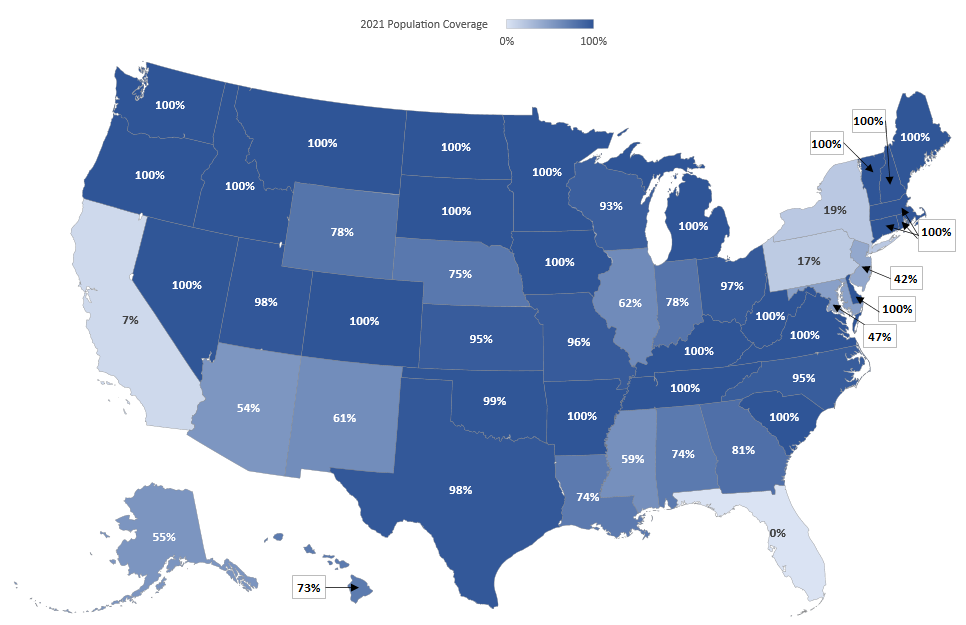
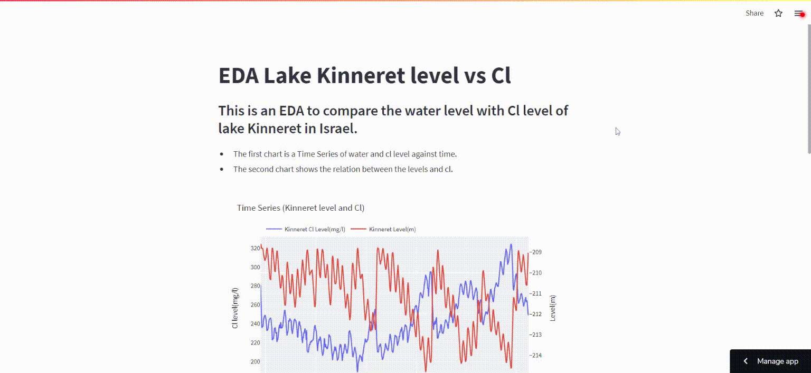
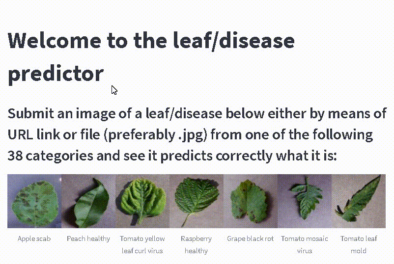

#### FBI crime data analysis

[This project](https://github.com/apollner/apollner.github.io/blob/main/FBI%20project/predicting-age-and-race-of-offender-nd-2021.ipynb) aims to analyze the FBI NIBRS (National Incident-Based Reporting System) data, and make predictions using **Machine Learning** models. The NIBRS is the way the FBI is currently asking police agencies across the US to report crime data in their jurisdictions. This is coming to replace the traditional Summary Reporting System (SRS) in which the data from crimes was aggregated and so details of crimes were not recorded.
NIBRS includes details on each single crime incident—as well as on separate offenses within the same incident—including information on victims, known offenders, relationships between victims and offenders, arrestees, and property involved in crimes.

Since the FBI discourages making comparison between states and years, I chose to analyze one state for the most recent year. 
There are many states like NY and CA that still fail to report many of their crimes 
The state I chose was North Dakota (2021) because it was one of the states with the highest percent of reported crimes (see map below).

All the FBI data is available [here](https://crime-data-explorer.fr.cloud.gov/pages/downloads)

#### [This](https://apollner-kinneret-water-kinneret-umvoo0.streamlitapp.com/) is an EDA of the water level and Cl level of lake Kinneret 

#### [This](https://share.streamlit.io/apollner/streamlit_plant_disease_app/main/plant_disease_classification.py)  is a leaf disease classifier/predictor

